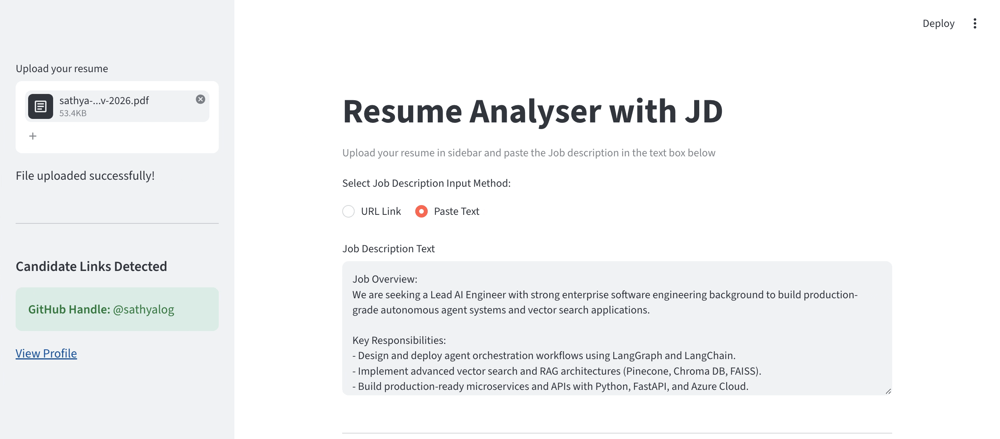
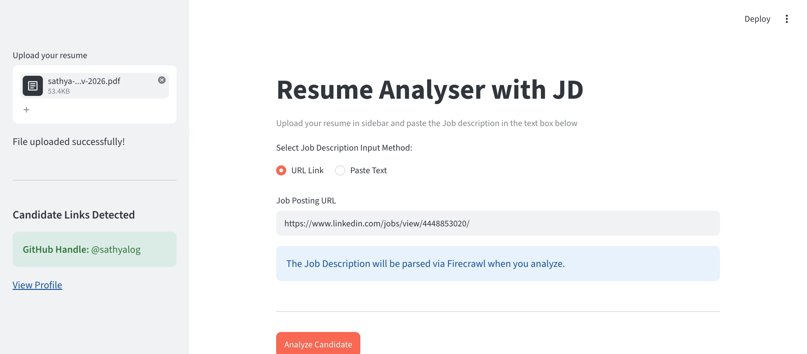

# Resume Analyser with Job Description (JD) Matching, 🚀 AI Career & Skill Hub Engine

A Streamlit-based LangGraph application designed to automatically analyze a candidate's resume against a Job Description (JD), evaluate skill compatibility, compare experience requirements, and route candidates through a deterministic decision graph (`ShortList` vs `Reject`). 

It features an intelligent multi-input ingestion pipeline—accepting either raw text or direct Job Posting URLs—backed by an AI-driven web scraper with deterministic fallback engines, automated PII scrubbing, live GitHub profile verification, and a multi-turn deep reflection agent for candidate career coaching.

---
Demo:
Shortlist Scenario:
 
Rejection Scenario:


 
 
 


---

## 🌟 How This Platform Helps Candidates

Navigating technical job markets requires candidates to demonstrate clear, verifiable technical depth while tailoring their experience across multiple channels. This platform serves as a centralized **Career & Skill Hub** that helps candidates:

1. **Verify Proof-of-Work via Real-Time GitHub MCP & Local Codebase Scanning**:
   * Instead of relying solely on self-reported resume claims, the system integrates a custom **Model Context Protocol (MCP)** server for live GitHub verification alongside a **Local Codebase Scanner** that extracts concrete implementation proofs directly from your local project files.
2. **Automate Job Description Matching & Alignment**:
   * Evaluates candidate resumes against real-world Job Descriptions (parsed via **Firecrawl** or direct text).
   * Generates deep reflection feedback using multi-turn LLM agent loops to highlight skill gaps and optimization areas.
3. **Prevent PII Leaks with Built-in Guardrails**:
   * Automatically scrubs sensitive personally identifiable information (PII) using **Microsoft Presidio** before sending context to LLMs, keeping candidate data secure.
4. **Generate High-Converting Multi-Channel Profiles**:
   * Uses a central structured JSON store (`skills.json`, `projects.json`, `responsibilities.json`, `challenges.json`) to dynamically format ATS-optimized resumes, story-driven LinkedIn About sections, and modern GitHub profile READMEs.
5. **Accelerate Interview Preparation with Code-Level Notes**:
   * Generates 2-3 sentence interview talking points linked directly to matching code snippets from your local repositories, alongside a 2-minute elevator pitch builder, STAR-formatted technical challenge breakdowns, and architectural cheatsheets.

---

## 🛠️ Key Technical Architecture & Features

### 1. 📄 Resume Analyser with JD Matching & Local Codebase Proof
* **Dual-Stage Job Description Ingestion**: Supports direct URL scraping powered by **Firecrawl API** with BeautifulSoup fallback and plain text parsing.
* **LangGraph State Machine**: Orchestrates PII scrubbing, extraction, qualification checks (Experience + Skill Match score), and conditional routing (`ShortList` vs `Reject`).
* **Deep Agent Reflection Loop**: Runs iterative verification on rejected applications to deliver actionable candidate feedback.
* **Gated Local Codebase Reader (`mcp_codebase.py`)**: Automatically unlocks post-analysis inside Tab 1, scanning up to 15 local repository directories for required JD skills and generating code-grounded interview talking points.
* **Observability & Tracing**: Fully instrumented with **LangSmith** (`@traceable`) to track node execution trajectories, token usage, and latency metrics.

### 2. ✍️ Skill Hub & Content Generator Studio
* **Auto-Parsing Ingestion**: Scrapes PDF resumes into structured, categorized JSON files covering project stacks, job responsibilities, STAR engineering challenges, and credentials.
* **Multi-Format Content Studio**:
  * **LinkedIn About Section**: Formatted with visual unicode markers, emoji indicators, core expertise matrices, and built-in code block copy functionality.
  * **ATS Resume Content**: Executive summary blocks, impact-driven bullet points, and categorized skills lists.
  * **GitHub Profile README**: Fully formatted Markdown profile README complete with repository showcases and tech stack badges.

### 3. 🎯 AI Interview Copilot
* **Day-to-Day Responsibilities Quick-Glance**: Instant reference matrix organized by role context.
* **STAR Challenge Storyteller**: Structures raw engineering incidents into clear *Situation, Task, Action, and Result* narratives.
* **Architecture Cheatsheet**: Generates system design trade-off guides based on candidate-specific tools (e.g., LangGraph PostgresSaver, Chroma DB HNSW metadata isolation, Redis caching).

---

## Folder structure
```text
.
├── core/                       # Core infrastructure, data contracts, and persistence layer
│   ├── schemas.py              # Centralized Pydantic schemas for LLM outputs, data validation, and graph state
│   └── storage.py              # Centralized I/O module for reading/writing local JSON and vector store updates
├── data/                       # Local JSON storage directory (auto-populated or manually ingested)
│   ├── challenges.json         # Engineering challenges and STAR-formatted incident responses
│   ├── misc.json               # Credentials, certifications, patents, and courses learned
│   ├── projects.json           # Projects, architecture descriptions, and tech stacks
│   ├── responsibilities.json   # Role-specific day-to-day responsibilities and leadership achievements
│   └── skills.json             # Categorized candidate skills and framework inventories
├── prompts/                    # YAML prompt templates for specialized studio formats
│   ├── github_prompts.yaml     # Prompts for generating GitHub Profile README markdown
│   ├── interview_prompts.yaml  # Prompts for interview answer strategies and architectural cheatsheets
│   ├── linkedin_prompts.yaml   # Prompts for LinkedIn summary, headline, and hashtag generation
│   └── resume_prompts.yaml     # Prompts for ATS-optimized resume summaries and bullet points
├── PII_detection.py            # Presidio-based PII scrubbing middleware (masks emails, phones, names)
├── deepagent_feedback.py       # LangGraph reflection nodes for multi-step candidate feedback loops
├── firecrawl_scraping.py       # Web scraping logic for fetching and parsing LinkedIn/Job Board URL JDs
├── mcp_github.py               # GitHub Model Context Protocol (MCP) integration for repo verification
├── helpers.py                  # Helper utilities (GitHub handle extraction, string parsing, etc.)
├── database.py                 # Pinecone vector store initialization and retrieval connector
├── main.py                     # Primary Streamlit multi-tab application UI controller and LangGraph flow router
└── requirements.txt            # Python dependencies and version pins
```
### Key Highlights of This Structure

* **`core/` Abstraction Layer**: Isolates application schemas and JSON file persistence, keeping UI rendering in `main.py` clean.
* **`data/` Persistence Store**: Houses granular candidate history as JSON documents to feed LLM generation nodes across profile output studios.
* **`prompts/` Config Layer**: Separates system instructions and context-formatting logic from Python source code for maintainability.


## 🎯 Key Objectives & Core Capabilities

1. **Flexible Job Ingestion & Dynamic Web Scraping**:
   * Evaluates candidates using either raw text JDs or direct job posting URLs.
   * **Self-Healing Scraping Pipeline**: Attempts AI-driven structured extraction via **Firecrawl API** (`onlyMainContent=True`) first, and seamlessly falls back to a deterministic **BeautifulSoup / HTTP** scraper for bot-restricted domain pages (e.g., LinkedIn, Glassdoor).

2. **Privacy-Preserving Entity Extraction**:
   * Sanitizes candidate resumes before transmitting data to external LLMs using **Microsoft Presidio PII Detection** to scrub sensitive identifiers (phone numbers, personal emails, physical addresses, UK NINOs).
   * Extracts grounded entities (`candidate_name`, `candidate_experience`, `job_title`, `experience_required`, `skill_match`) using structured **Pydantic** LLM output models.

3. **Deterministic Graph Routing (LangGraph)**:
   * Orchestrates execution using conditional edges based on explicit evaluation criteria:
     * Candidate Experience $\ge$ Job Requirement
     * Skill Match Score $\ge 0.50$
   * Automatically routes candidates to `ShortList` or `Reject` graph nodes.

4. **Deep Reflection Agent & Candidate Coaching**:
   * Runs a multi-turn reflection loop (**Deep Agent Pattern**) for rejected candidates to audit false negatives against alternative terminology (e.g., verifying `Docker` vs `Containerization`) and generate constructive skill gap advice.

5. **Live Candidate Proof-of-Work Verification (GitHub MCP)**:
   * Detects GitHub handles from resumes automatically and queries GitHub APIs via an asynchronous **Model Context Protocol (MCP)** client to display real-time commit history, language distributions, and repository metrics.

6. **Target Profile Formatter & AI Career Studio**:
   * Auto-populates central candidate context files (`skills.json`, `projects.json`, `responsibilities.json`, `challenges.json`, `misc.json`).
   * **LinkedIn Profile Studio**: Generates executive LinkedIn headlines, structured About sections with copyable code blocks, and featured hashtags.
   * **ATS Resume Content**: Produces executive professional summaries, high-impact bullet points, and categorized technical skill blocks.
   * **GitHub Profile README**: Creates valid Markdown profile READMEs complete with tech stack shields and repository showcases.
   * **AI Interview Copilot**: Drafts 2-minute elevator pitches ("Tell Me About Yourself"), STAR-formatted technical challenge breakdowns, and system design architecture cheatsheets.


---

## 📦 Imported Modules & Purpose

| Module / Dependency | Purpose / Why it is used |
| :--- | :--- |
| `streamlit` (`st`) | Provides the web UI interface for document uploads (PDFs) and text input fields (JD). |
| `langgraph.graph` (`START`, `END`, `StateGraph`) | Constructs the stateful execution graph and handles conditional routing based on criteria evaluations. |
| `langchain_openrouter` (`ChatOpenRouter`) | Interfaces with LLM models hosted via OpenRouter (e.g., GPT-3.5 / GPT-4 family). |
| `pydantic` (`BaseModel`, `Field`) | Defines the structured JSON output schema expected from the LLM extraction step. |
| `typing` (`TypedDict`, `Literal`, `Optional`) | Provides static type annotations for state management across LangGraph nodes. |
| `pinecone` (`Pinecone`) | Initializes the Pinecone vector client for downstream index management and retrieval tasks. |
| `dotenv` (`load_dotenv`) | Loads environment credentials (`PINECONE_API_KEY`, API tokens) securely from `.env`. |
| `database` (`create_index`) | Custom local database module to initialize vector database indexes. |
| `os` | Reads system environment variables safely. |
`firecrawl` (`Firecrawl`) | Scrapes job posting URLs dynamically into structured Markdown/JSON payloads using AI-powered web extraction. |
| `beautifulsoup4` / `requests` | Acts as a deterministic HTTP fallback scraper when target domains (e.g., LinkedIn, Glassdoor) restrict third-party cloud scrapers. |

---

## How to run the code?
`uv run streamlit run main.py`

.env file should have:
```
OPENROUTER_API_KEY=sk-your-key
LANGSMITH_API_KEY=ls-your-key
LANGSMITH_TRACING=true
LANGSMITH_PROJECT=resume-analyser
PINECONE_API_KEY=pcsk_your-key
GITHUB_PERSONAL_ACCESS_TOKEN=your_github_token_here
FIRECRAWL_API_KEY=fc-your-firecrawl-key
```

## How to test this?
My resume I uploaded here is related to Advanced Agentic AI engineer CV with 14+ years of experience and tech stack is LangGraph, Pinecone, Azure, Python, Pydantic along with ReactJS, Nodejs, Azure.  Hence based on this I created 2 JD's one for shortlisting and another for rejection.

### Shortlisting JD:
Job Title: Lead AI / GenAI Engineer

Job Overview:
We are seeking a Lead AI Engineer with strong enterprise software engineering background to build production-grade autonomous agent systems and vector search applications.

Key Responsibilities:
- Design and deploy agent orchestration workflows using LangGraph and LangChain.
- Implement advanced vector search and RAG architectures (Pinecone, Chroma DB, FAISS).
- Build production-ready microservices and APIs with Python, FastAPI, and Azure Cloud.
- Apply LLM safety guardrails, structured outputs (Pydantic), and semantic caching.

Requirements:
- 10+ years of total software development experience with at least 3+ years focused on GenAI and LLM systems.
- Deep expertise in LangGraph, Python, Vector Databases, and Azure AI infrastructure.
- Proven track record of architecting scalable enterprise backend platforms.

Based on above JD, here is my application output:
 


### Rejection JD:
Job Title: Principal AI Research Architect

Job Overview:
We are seeking a Principal AI Research Architect to lead advanced machine learning model training and hardware optimization for deep learning execution.

Key Responsibilities:
- Develop custom PyTorch C++ kernels and train LLMs from scratch on multi-node GPU clusters.
- Optimize CUDA performance and Low-Level Virtual Machine (LLVM) compilers for neural network inference.
- Conduct foundational mathematical research in non-Euclidean geometry and quantum computing algorithms.

Requirements:
- 18+ years of hands-on experience in low-level C++/CUDA systems programming and core deep learning research.
- Proven record of training 100B+ parameter LLM base models from scratch.

Based on above JD, here is my application output:

 


## Added traceables to see tracings in langsmith studio as follows..


## MCP server integration
The GitHub MCP (Model Context Protocol) integration connects your application directly to GitHub's external APIs via the @modelcontextprotocol/server-github server and langchain-mcp-adapters.

By automatically extracting a candidate's GitHub handle from their uploaded resume, the application invokes prebuilt MCP tools (search_repositories and list_commits) using an asynchronous MultiServerMCPClient. This retrieves real-time repository metadata, programming languages, star counts, and recent 2026 commit activity without manual API wrapper maintenance, presenting live proof-of-work tables right alongside the LLM screening results.

 


#### Added Resume<->Github Matching score in application:


#### Introducing PII Detection
Implementing PII (Personally Identifiable Information) detection ensures sensitive candidate data from resume—such as phone numbers, email addresses, physical addresses, and national identity numbers—is scrubbed before reaching external LLMs, vector databases, or logs.

**Selecting the PII Detection engine**

1.Microsoft Presidio: https://presidio.dataprivacystack.org/

2.Langchain PII Middleware: `from langchain.agents.middleware import PIIMiddleware`

1.	Framework Boundary vs. Engine Depth
⚬	LangChain Middleware is an interceptor pattern. It automatically hooks into LangChain agent steps to scrub text before sending prompts to the model or passing arguments to tools.
⚬	Microsoft Presidio is an detection & anonymization engine. It doesn't care whether you are using LangGraph, FastAPI, or a basic Python script; it focuses on identifying sensitive entities with precision using Machine Learning and NLP.

2.	Detection Quality & Entity Coverage
⚬	Simple middleware wrappers often rely on standard regex for basic patterns (emails, phone numbers).
⚬	Presidio identifies complex, context-dependent entities like personal names (PERSON), physical addresses (LOCATION), and region-specific IDs (UK_NINO, US_SSN) by analyzing surrounding sentence structure.

### 🧠 Deep Agent Reflection & Candidate Feedback Loop
This application incorporates a Deep Reflection Agent Pattern designed to convert raw rejection outcomes into constructive candidate feedback. Rather than serving static rejection messages, the pipeline initiates a multi-turn reasoning loop using LangGraph to evaluate missing job requirements and suggest targeted skill improvements.

                  ┌──────────────────────────────┐
                  │   Candidate Evaluated: REJECT│
                  └──────────────┬───────────────┘
                                 │
                                 ▼
                   ┌───────────────────────────┐
                   │   GenerateRejectFeedback  │
                   └─────────────┬─────────────┘
                                 │
                                 ▼
                   ┌───────────────────────────┐
                   │     ReflectAndVerify      │
                   └─────────────┬─────────────┘
                                 │
                   ┌─────────────┴─────────────┐
                   │  ShouldContinueReflection │
                   └─────────────┬─────────────┘
                                 │
                    ┌────────────┴────────────┐
                    ▼                         ▼
            [Iterate 2-3x]           [Feedback Verified]
        GenerateRejectFeedback        FinalizeFeedback

How It Works & Methods Introduced

	1.	GenerateRejectFeedback: Analyzes gaps between the scrubbed resume and job description requirements using structured Pydantic models to identify missing core competencies and actionable skill-bridging advice.
	2.	ReflectAndVerify: Functions as a senior hiring quality auditor. It inspects proposed feedback against the full resume to verify whether missing skills are genuinely absent or simply phrased using alternative industry terminology (e.g., verifying Containerization vs. Docker).
	3.	ShouldContinueReflection: A conditional routing function that controls the multi-turn loop. The deep agent reflects and re-checks its feedback 2–3 times until the gap analysis is fully verified or maximum reflection passes are reached.
	4.	FinalizeFeedbackNode: Formats the verified, hallucination-checked feedback for display on the recruiter UI.

Finally after integrating deep agent, this is how system will show suggestions after rejection with proper skill gap analysis.


### 🛠️ Dynamic Web Scraping Architecture

### **How the Dynamic Web Scraping Pipeline Works**

* **Self-Healing URL Ingestion**: Handles both open career portals and domain-restricted job pages without crashing the user interface or returning empty evaluations.
* **Tier 1 — Firecrawl AI Extraction**: Ingests URL links and attempts structured extraction directly via Firecrawl's AI rendering engine into a validated `Pydantic` schema (`job_title`, `required_skills`, `years_experience_required`).
* **Tier 2 — Deterministic BeautifulSoup Fallback**: If Firecrawl encounters anti-bot restrictions (e.g., LinkedIn, Glassdoor, or paywalled sites), the system catches the exception and immediately invokes a fallback HTTP scraper. It uses `requests` and `BeautifulSoup` to strip non-content tags (`<script>`, `<style>`, `<nav>`) and returns clean text directly to downstream LangGraph evaluation nodes.

**How the Web Scraping Flow Works:**

	1.	User URL Submission: The recruiter enters a Job Description link directly into the Streamlit interface instead of manually copying and pasting raw text.

	2.	Primary Route (Firecrawl AI Extraction):
⚬	The URL is first passed to the Firecrawl API to attempt structured JSON/Markdown extraction using LLM-driven web rendering.
⚬	If the site is accessible and supported, Firecrawl returns a structured JSON payload containing the job_title, years_experience_required, required_skills, and job_overview.

	3.	Automated Fallback Trigger:
⚬	If Firecrawl fails, raises a rate limit error, or gets blocked by domain policies (e.g., restricted access on sites like LinkedIn or Glassdoor), the application automatically catches the exception without crashing the UI.

	4.	Secondary Route (BeautifulSoup / HTTP Scraper):
⚬	The pipeline switches to a lightweight requests HTTP engine with standard browser headers to bypass cloud scraper locks.
⚬	BeautifulSoup parses the target page DOM, strips away noisy boilerplate elements 

	5.	LLM Ingestion: The extracted raw text is then passed downstream into your existing AnalyseResumeWithJD LangGraph node, letting the core LLM parse requirements deterministically.


### New Updates
* **Anthropic Integration:** Upgraded model execution pipeline to native `langchain-anthropic` (`claude-haiku-4-5-20251001`) for faster latency, lower token unit costs, and strict Pydantic structured output validation.
* **Token-Optimized Web Scraping:** Implemented native Firecrawl filtering (`onlyMainContent=True`, DOM tag exclusion) alongside regex-based markdown compression to strip boilerplate UI noise, cutting context size by over 60%.
* **Deterministic Fallback Extraction:** Enhanced scraping pipelines with automated heuristic fallbacks to reliably infer job metadata (titles and experience baselines) when scraping restricted or low-context web pages.

## UI Improvements:
Show company info, role and required experience in one section and similarly candidate details in separate section as follows.

